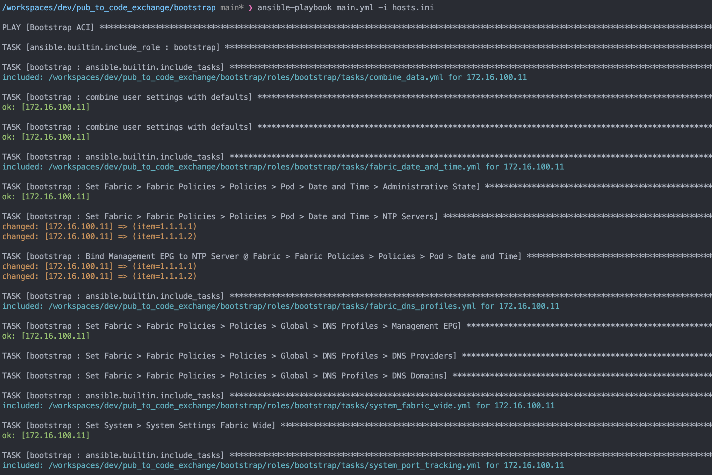

# Cisco ACI bootstrap

## Prerequisites
* Cisco ACI
* Ansible

## Use Case Description
The goal of this project is to help enginners bootstrap their newly set-up ACI installation according to Cisco best-practices. Note that it´s possible to bootstrap more settings than included in these files (for example BGP RR, MCP, Switch Onboarding and so on and so forth). Contact Miradot for more information!

## Installation
```
ansible-galaxy collection install -r requirements.yml
```

## Usage
1) Populate `vars_files/main.yml` with any settings the engineer might want to override. The file already contains some examples of how to override the default settings. All settings found in `roles/bootstrap/defaults/main.yml` can be overriden in the same fashion.

2) Populate `hosts.ini` with the IP of the ACI controller.

3) Populate `group_vars/aci/vault.yml` with username and password. Also recommeded is to encrypt the file with Ansible vault `ansible-vault encrypt group_vars/aci/vault.yml`

4) Run the playbook `ansible-playbook main.yml -i hosts.ini`

### Example of main.yml to run the boostrap role

```yaml
# Content of main.yml, this is how the playbook running the bootstrap should look like.
---
- name: Bootstrap ACI
  gather_facts: no
  hosts: aci
  connection: local
  vars_files:
    - ./vars_files/main.yml

  tasks:
    - ansible.builtin.include_role:
        name: bootstrap
...
```

## Example of Ansible Output


## Getting help

If you have questions, concerns, bug reports, etc., please create an issue against this repository.

## Getting involved

This project is supposed to help enginners bootstrap their ACI with all the bells and wistles that is needed. If you have any suggestions on what else to include, feel free to reach ut by creating an issue.

## Licensing info

`Copyright (c) 2022, Miradot AB`

This code is licensed under the MIT License. See [LICENSE](./LICENSE) for details.
